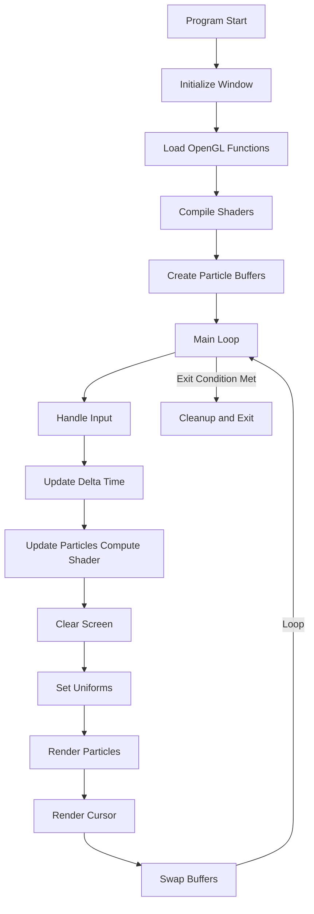
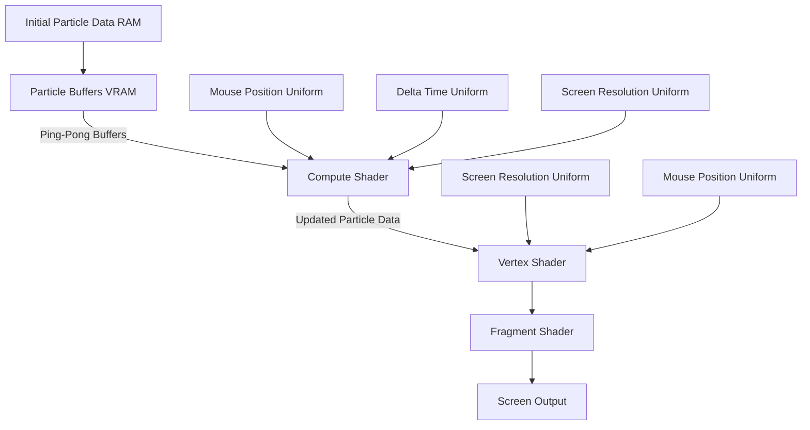

# OpenGL Fractal Shader Demo

## Program Flow

```mermaid
graph TD
    A[Program Start] --> B[Initialize Window]
    B --> C[Load OpenGL Functions]
    C --> D[Compile Shaders]
    D --> E[Create Particle Buffers]
    E --> F[Main Loop]
    
    F --> G[Handle Input]
    G --> H[Update Delta Time]
    H --> I[Update Particles Compute Shader]
    I --> J[Clear Screen]
    J --> K[Set Uniforms]
    K --> L[Render Particles]
    L --> M[Render Cursor]
    M --> N[Swap Buffers]
    N --> |Loop| F
    
    F --> |Exit Condition Met| O[Cleanup and Exit]
```

## Data Flow

```mermaid
graph TD
    A[Initial Particle Data RAM] --> B[Particle Buffers VRAM]
    B --> |Ping-Pong Buffers| C[Compute Shader]
    C --> |Updated Particle Data| D[Vertex Shader]
    D --> E[Fragment Shader]
    E --> F[Screen Output]
    
    G[Mouse Position Uniform] --> C
    H[Delta Time Uniform] --> C
    I[Screen Resolution Uniform] --> C
    J[Screen Resolution Uniform] --> D
    K[Mouse Position Uniform] --> D
```

gcc -std=c11 -Os -s -mwindows -Wall -I. demo.c shader_utils.c -o demo.exe -lopengl32 -lgdi32 -lwinmm -lglu32